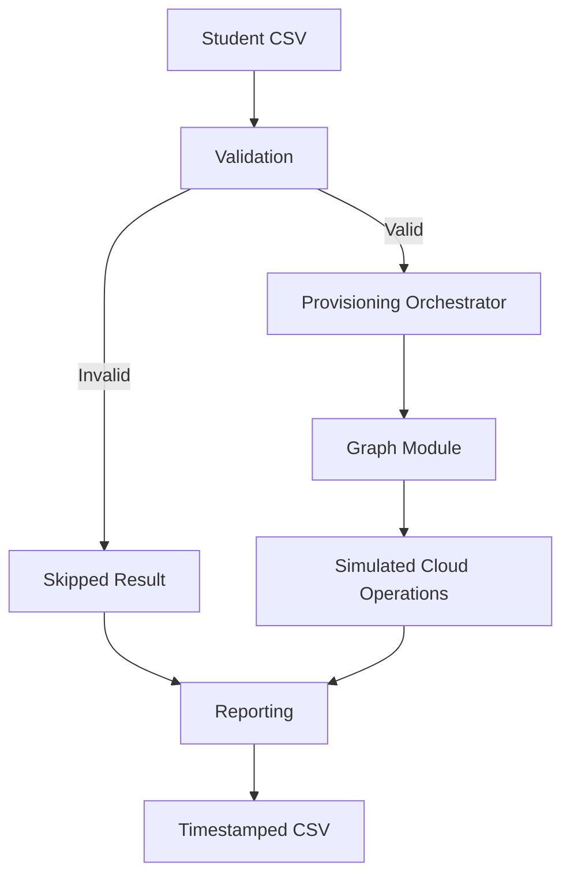

# Student Provisioning Pipeline

Production-inspired PowerShell automation for student identity provisioning in Microsoft 365.

> This repository is a clean-room portfolio implementation based on real operational experience. Organization-specific data, tenant configuration, credentials, identifiers, proprietary implementation details, and production source code are intentionally excluded.

## Why This Project Exists

The design models a workflow that replaced a multi-hour manual student account process with a repeatable automation pipeline. This public implementation demonstrates the engineering structure, safety controls, validation, reporting, and operational reasoning without connecting to a real Microsoft 365 tenant.

## What It Demonstrates

- PowerShell orchestration and reusable modules
- CSV-driven workflow design
- Input validation and structured error handling
- Microsoft Graph integration architecture
- Configuration separation
- Safe simulation and `-WhatIf` behavior
- Success, failed, skipped, and simulated outcomes
- Timestamped CSV reporting
- Pester tests
- PSScriptAnalyzer static analysis
- GitHub Actions continuous integration
- Security-conscious portfolio sanitization

## Architecture



See [docs/architecture.md](docs/architecture.md) for component responsibilities and design decisions.

## Repository Structure

```text
student-provisioning-pipeline/
├── .github/
│   └── workflows/
│       └── powershell-quality.yml
├── Config/
│   └── settings.example.psd1
├── Modules/
│   ├── Graph.psm1
│   ├── Reporting.psm1
│   └── Validation.psm1
├── Samples/
│   └── students.example.csv
├── Tests/
│   ├── Pipeline.Tests.ps1
│   ├── Reporting.Tests.ps1
│   └── Validation.Tests.ps1
├── docs/
│   └── architecture.md
├── Invoke-StudentProvisioning.ps1
├── PSScriptAnalyzerSettings.psd1
└── README.md
```

Runtime `Logs/` and `Reports/` directories are intentionally excluded from source control.

## Prerequisites

- PowerShell 7.2 or later
- No Microsoft 365 tenant is required for portfolio simulation
- Pester 5 and PSScriptAnalyzer are required only for local quality checks

Install the quality modules:

```powershell
Install-Module Pester -MinimumVersion 5.5.0 -Scope CurrentUser -Force
Install-Module PSScriptAnalyzer -Scope CurrentUser -Force
```

## Quick Start

Clone the repository and enter the project directory:

```powershell
git clone https://github.com/C2LB/student-provisioning-pipeline.git
Set-Location ./student-provisioning-pipeline
```

Run the sample pipeline:

```powershell
./Invoke-StudentProvisioning.ps1
```

Preview the targets without executing the simulated provisioning block:

```powershell
./Invoke-StudentProvisioning.ps1 -WhatIf
```

Use explicit input and configuration paths:

```powershell
./Invoke-StudentProvisioning.ps1 `
    -InputCsv ./Samples/students.example.csv `
    -ConfigPath ./Config/settings.example.psd1
```

## Expected Behavior

For each CSV record, the pipeline:

1. Validates the required student name and email.
2. Marks invalid records as `Skipped` with a reason.
3. Sends valid records to the Graph integration boundary.
4. Returns a safe `Simulated` result in portfolio mode.
5. Catches record-level failures without terminating the full batch.
6. Writes a timestamped report to `Reports/`.

Example result:

```text
StudentName     Email                            Status     Message
-----------     -----                            ------     -------
Avery Johnson   avery.johnson@contoso.example   Simulated  Portfolio scaffold - no tenant changes performed.
Jordan Smith    jordan.smith@contoso.example     Simulated  Portfolio scaffold - no tenant changes performed.
Taylor Brown    taylor.brown@contoso.example     Simulated  Portfolio scaffold - no tenant changes performed.
```

## Input Contract

The CSV must contain:

| Column | Required | Validation |
|---|---:|---|
| `StudentName` | Yes | Cannot be blank |
| `Email` | Yes | Must resemble a valid email address |

The example file uses fictional `contoso.example` addresses.

## Configuration

`Config/settings.example.psd1` contains fictional values for:

- organization name
- tenant identifier and domain
- usage location
- license profile
- default student group
- report and log paths

Real configuration files should use excluded filenames such as `Config/settings.psd1` and must never be committed with secrets or production identifiers.

## Quality Checks

Run static analysis:

```powershell
$findings = Invoke-ScriptAnalyzer `
    -Path . `
    -Recurse `
    -Settings ./PSScriptAnalyzerSettings.psd1

$findings | Format-Table -AutoSize
```

Run tests:

```powershell
Invoke-Pester -Path ./Tests -CI -Output Detailed
```

GitHub Actions runs static analysis, Pester tests, and a sample smoke test on Windows and Linux for every pull request and relevant push.

## Design Decisions

| Decision | Reason |
|---|---|
| Separate orchestration from modules | Makes validation, cloud operations, and reporting independently testable |
| Use configuration data files | Keeps environment-specific values out of the orchestration logic |
| Return structured result objects | Supports consistent reporting and batch-level visibility |
| Continue after record-level errors | One bad record should not terminate the entire batch |
| Keep Graph operations simulated | Demonstrates architecture without risking a real tenant or exposing proprietary code |
| Support `ShouldProcess` | Provides a standard PowerShell safety boundary |
| Test on Windows and Linux | Confirms the portfolio scaffold is not accidentally tied to one workstation |

## Security Model

This repository contains no:

- credentials, secrets, or certificates
- production tenant, application, group, or license identifiers
- real student records or internal domains
- employer-specific configuration
- copied production implementation

The Graph module is deliberately an integration boundary. A production implementation would use an approved app registration, certificate-based authentication, least-privilege permissions, protected configuration, auditable logging, and operational approval controls.

## Current Limitations

- Microsoft Graph authentication and write operations are not implemented.
- The sample workflow does not create or modify real identities.
- Email validation intentionally checks structure rather than full RFC compliance.
- The portfolio scaffold does not model every production exception or recovery path.
- Tests validate the public implementation, not the private production environment.

These limitations are intentional safety boundaries, not hidden claims of production completeness.

## Roadmap

Potential future improvements:

- dependency injection for a mockable Graph client
- richer CSV schema and validation rules
- JSON or structured event logging
- Pester code-coverage thresholds
- signed release artifacts
- optional live integration implemented only against a dedicated sandbox tenant

## Background

The architecture is based on experience automating a previously manual student account-processing workflow in a production Microsoft 365 environment. The original process required multiple operational steps and several hours of manual work. The automation introduced structured inputs, repeatable processing, consistent outcomes, and reporting while reducing operator effort substantially.
