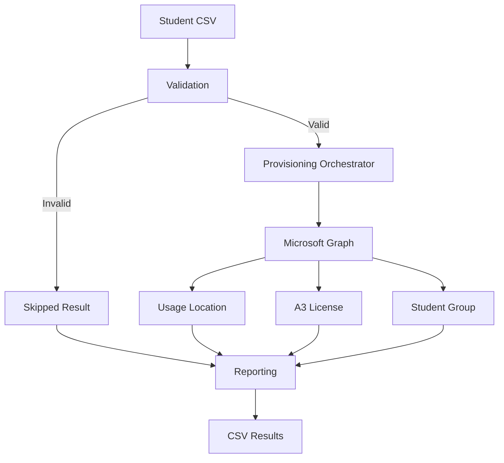

# Architecture

## Design Goals

- Keep input validation separate from cloud operations.
- Keep environment-specific values outside the main script.
- Never store tenant secrets in source control.
- Return structured success, failure, and skipped results.
- Make the workflow understandable without access to the production environment.